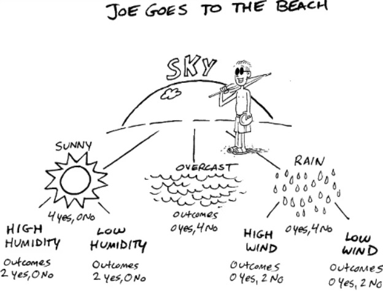
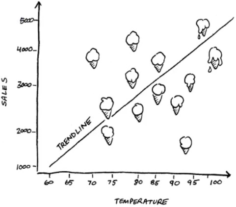

# Linkedin-Assessment-Test-Machine-Learning
#### Q1. You are part of data science team that is working for a national fast-food chain. You create a simple report that shows trend: Customers who visit the store more often and buy smaller meals spend more than customers who visit less frequently and buy larger meals. What is the most likely diagram that your team created?

- [ ] multiclass classification diagram
- [x] linear regression and scatter plots
- [ ] pivot table
- [ ] K-means cluster diagram

#### Q2. You work for an organization that sells a spam filtering service to large companies. Your organization wants to transition its product to use machine learning. It currently a list Of 250,00 keywords. If a message contains more than few of these keywords, then it is identified as spam. What would be one advantage of transitioning to machine learning?

- [ ] The product would look for new patterns in spam messages.
- [ ] The product could go through the keyword list much more quickly.
- [ ] The product could have a much longer keyword list.
- [x] The product could find spam messages using far fewer keywords.

#### Q3. You work for a music streaming service and want to use supervised machine learning to classify music into different genres. Your service has collected thousands of songs in each genre, and you used this as your training data. Now you pull out a small random subset of all the songs in your service. What is this subset called?

- [ ] data cluster
- [ ] Supervised set
- [ ] big data
- [x] test data

#### Q4. In traditional computer programming, you input commands. What do you input with machine learning?

- [ ] patterns
- [ ] programs
- [ ] rules
- [x] data

#### Q5. Your company wants to predict whether existing automotive insurance customers are more likely to buy homeowners insurance. It created a model to better predict the best customers contact about homeowners insurance, and the model had a low variance but high bias. What does that say about the data model?

- [x] It was consistently wrong.
- [ ] It was inconsistently wrong.
- [ ] It was consistently right.
- [ ] It was equally right end wrong.

[Reference](https://medium.com/datadriveninvestor/bias-and-variance-in-machine-learning-51fdd38d1f86)

#### Q6. You want to identify global weather patterns that may have been affected by climate change. To do so, you want to use machine learning algorithms to find patterns that would otherwise be imperceptible to a human meteorologist. What is the place to start?

- [ ] Find labeled data of sunny days so that the machine will learn to identify bad weather.
- [x] Use unsupervised learning have the machine look for anomalies in a massive weather database.
- [ ] Create a training set of unusual patterns and ask the machine learning algorithms to classify them.
- [ ] Create a training set of normal weather and have the machine look for similar patterns.

#### Q7. You work in a data science team that wants to improve the accuracy of its K-nearest neighbor result by running on top of a naive Bayes result. What is this an example of?

- [ ] regression
- [ ] boosting
- [ ] bagging
- [x] stacking

#### Q8. `____` looks at the relationship between predictors and your outcome.

- [x] Regression analysis
- [ ] K-means clustering
- [ ] Big data
- [ ] Unsupervised learning

#### Q9. What is an example of a commercial application for a machine learning system?

- [ ] a data entry system
- [ ] a data warehouse system
- [ ] a massive data repository
- [x] a product recommendation system

#### Q10. What does this image illustrate?

- [x] a decision tree
- [ ] reinforcement learning
- [ ] K-nearest neighbor
- [ ] a clear trendline

#### Q11. You work for a power company that owns hundreds of thousands of electric meters. These meters are connected to the internet and transmit energy usage data in real-time. Your supervisor asks you to direct project to use machine learning to analyze this usage data. Why are machine learning algorithms ideal in this scenario?

- [ ] The algorithms would help the meters access the internet.
- [ ] The algorithms will improve the wireless connectivity.
- [x] The algorithms would help your organization see patterns of the data.
- [ ] By using machine learning algorithms, you are creating an IoT device.

#### Q12. To predict a quantity value. use `___`.

- [x] regression
- [ ] clustering
- [ ] classification
- [ ] dimensionality reduction

#### Q13. Why is naive Bayes called naive?

- [ ] It naively assumes that you will have no data.
- [ ] It does not even try to create accurate predictions.
- [x] It naively assumes that the predictors are independent from one another.
- [ ] It naively assumes that all the predictors depend on one another.

#### Q14. You work for an ice cream shop and created the chart below, which shows the relationship between the outside temperature and ice cream sales. What is the best description of this chart?

- [x] It is a linear regression chart.
- [ ] It is a supervised trendline chart.
- [ ] It is a decision tree.
- [ ] It is a clustering trend chart.

#### Q15. How is machine learning related to artificial intelligence?

- [ ] Artificial intelligence focuses on classification, while machine learning is about clustering data.
- [x] Machine learning is a type of artificial intelligence that relies on learning through data.
- [ ] Artificial intelligence is form of unsupervised machine learning.
- [ ] Machine learning and artificial intelligence are the same thing.
